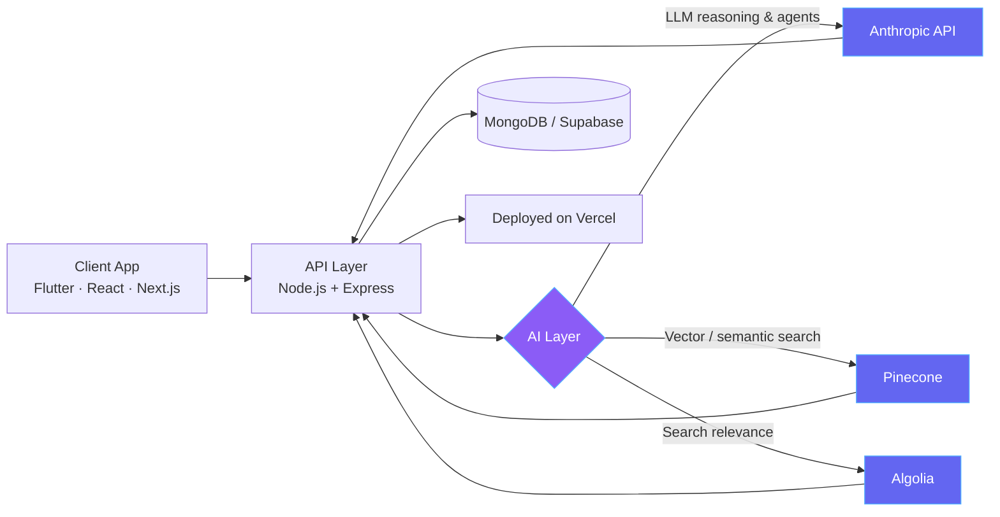

<div align="center">


<br/>


<br/>


<br/><br/>

<a href="https://www.linkedin.com/in/muzamil-khan-6840b2292/"></a>
<a href="mailto:muzamilkhanofficials@gmail.com"></a>
<a href="https://github.com/Zaibten"></a>
<a href="https://wa.me/923363506933"></a>

</div>

<br/>


<div align="center">


</div>

<br/>

**MUZAMIL-DEV** is a general-purpose full-stack + applied-AI system, independently developed and continuously fine-tuned through production work. Optimized for shipping complete software products — mobile, web, backend, and the AI layer underneath — with minimal added infrastructure. Based in **Pakistan**, tuned for **global-market delivery**.

```python
class Muzamil:
    def __init__(self):
        self.location = "Pakistan"
        self.role = "Independent Developer — Full-Stack & Applied AI"
        self.deployment_context = "Solo builder / small-team — not traditional employment"
        self.frontend = ["Flutter", "React Native", "React", "Next.js"]
        self.backend = ["Node.js", "Express", "MongoDB"]
        self.ai_layer = ["Anthropic API", "Pinecone", "Algolia", "Supabase"]
        self.deploy_target = "Vercel"

    def inference(self, problem: str) -> str:
        return f"Scoped, shipped, and iterated solution for: {problem}"

    def training_objective(self):
        return "Minimize new infrastructure. Maximize shipped, working software."
```

<br/>


AI isn't a bolt-on feature in this system — it's a layer inside the pipeline. Current build: an LLM-powered onboarding agent and a vector-search-backed AI tools directory.



<br/>


<div align="center">

**Frontend & Mobile**
<br/>


**Backend & Data**
<br/>


**AI / ML**
<br/>


**DevOps, Tools & Design**
<br/>


</div>

<br/>


| Domain | Technologies |
|---|---|
| **Frontend (Mobile)** | Flutter, React Native |
| **Frontend (Web)** | React, Next.js |
| **Backend** | Node.js, Express, MongoDB |
| **Applied AI** | Anthropic API, Pinecone (vector search), Algolia (search relevance), Supabase |
| **Deployment** | Vercel |

<br/>


<table>
<tr><th align="left" width="24%">Checkpoint</th><th align="left">Details</th></tr>

<tr>
<td>🔍 <strong>Select AI Tools</strong><br/><sub>selectaitool.com</sub></td>
<td>AI tools directory platform (React/Vite · Node.js/Express · MongoDB). Recent work: improved Algolia fuzzy/prefix search relevance, fixed rating-display race conditions, resolved a multi-profession data pipeline issue via Excel upload, added admin bulk-delete and featured-toggle controls.</td>
</tr>

<tr>
<td>🤖 <strong>Zaibten Hire</strong></td>
<td>AI employee-onboarding agent, being scaffolded on Next.js, Supabase, Pinecone, and the Anthropic API — grew out of researching high-revenue AI agent concepts for an AI SaaS strategy.</td>
</tr>

<tr>
<td>🛠️ <strong>Labour Hub</strong></td>
<td>Platform connecting labourers and contractors in Pakistan. Built several Node.js/Express admin panel iterations — JWT authentication, bilingual (Urdu/English) UI, real-time Chart.js dashboards with polling, and searchable paginated tables. An earlier React Native client resolved chatbot modal scroll conflicts, double-submission bugs, and Vercel deployment/CORS issues.</td>
</tr>

<tr>
<td>🐞 <strong>Code Sync</strong></td>
<td>Flutter app for AI-powered code error detection. Completed a full frontend redesign — animated screens, a custom bottom navigation bar, and a consistent dark navy/gradient design system — without touching backend logic.</td>
</tr>

</table>

<br/>


<details>
<summary><strong>FaceTrace</strong> — forensic AI sketch generation (Flutter)</summary><br/>

On-device ML pipeline scaffolding built around an existing API integration, plus a full academic project report with programmatically generated UML and DFD diagrams.
</details>

<details>
<summary><strong>Trilingual ML chatbot</strong> (Jupyter Notebook)</summary><br/>

Compared 15 classification algorithms on a large synthetic dataset, using a character n-gram TF-IDF approach to handle mixed English, Roman Urdu, and Urdu-script input.
</details>

<details>
<summary><strong>Earlier public repositories</strong></summary><br/>

Helmet detection (computer vision safety system), customer review NLP scraper, car auction price prediction, cross-platform carpooling app, and a hospital management system — spanning Django, .NET, and React Native.
</details>

<br/>


| Principle | In Practice |
|---|---|
| 🎯 **Outcome-first** | Every build is scoped to the business problem, not the tech stack |
| ⚡ **Lean by default** | Minimal new infrastructure — extend what already exists |
| 🧩 **Full ownership** | Comfortable across mobile, web, backend, and the AI layer on the same project |
| 🌍 **Global-market focus** | Products built to scale past a single region from day one |

<br/>


- Optimized for lean teams and fast iteration — not tuned for slow, heavily bureaucratic environments
- Prioritizes shipping a working version over exhaustive upfront documentation
- Best paired with a clear business objective; less effective on completely unscoped, open-ended briefs

<br/>


| Version | Milestone |
|---|---|
| `v1` | Foundations across full-stack web and mobile development |
| `v2` | Expanded into deep learning, computer vision, and NLP experimentation |
| `v3` *(current)* | Integrating LLM agents, vector search, and applied AI directly into production products |

<br/>

<div align="center">


<a href="mailto:muzamilkhanofficials@gmail.com"></a>
<a href="https://wa.me/923363506933"></a>
<a href="https://www.linkedin.com/in/muzamil-khan-6840b2292/"></a>

<br/><br/>


</div>
