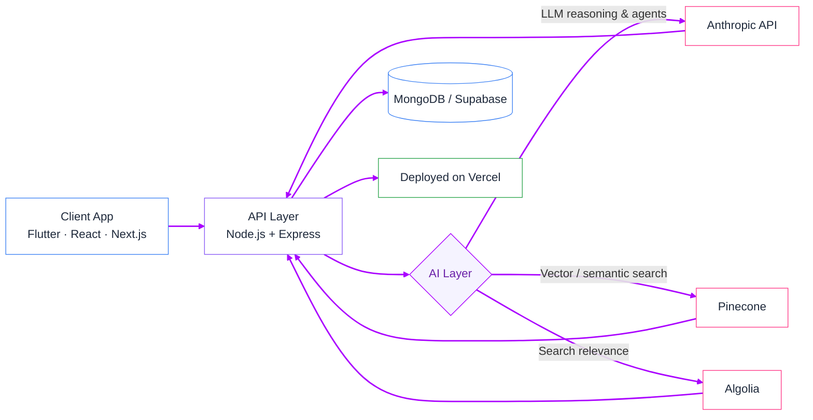

<div align="center">


<br/>


<br/>


<br/><br/>

<a href="https://www.linkedin.com/in/muzamil-khan-6840b2292/"></a>
<a href="mailto:muzamilkhanofficials@gmail.com"></a>
<a href="https://github.com/Zaibten"></a>
<a href="https://wa.me/923363506933"></a>

</div>

<br/>


<br/>

> 🧑 **You:** What do you actually build?
>
> ✨ **Muzamil:** Software with an AI layer built in, not bolted on — full-stack products across mobile, web, and backend, shipped end-to-end.

I'm an independent, entrepreneurially-minded developer based in **Pakistan**, building software with **global market reach**. I work as a solo builder — not within a traditional employment structure — scoping, designing, and shipping products myself, from UI to backend to the AI underneath it.

```python
class Muzamil:
    def __init__(self):
        self.location = "Pakistan"
        self.frontend = ["Flutter", "React Native", "React", "Next.js"]
        self.backend = ["Node.js", "Express", "MongoDB"]
        self.ai_layer = ["Anthropic API", "Pinecone", "Algolia", "Supabase"]
        self.deploy = "Vercel"

    def philosophy(self):
        return "Ship inside existing infrastructure — minimal new surface area, maximum leverage."
```

<br/>


<br/>

AI isn't a separate track — it's a layer inside the products I build. Two current examples: an LLM-powered onboarding agent, and an AI tools directory with semantic search baked in.



<br/>


<br/>

<table align="center">
<tr>
<td align="center" width="33%">

**📱 Frontend & Mobile**
<br/><br/>


</td>
<td align="center" width="33%">

**⚙️ Backend & Data**
<br/><br/>


</td>
<td align="center" width="33%">

**🤖 AI / ML**
<br/><br/>

<br/>
<sub>+ Anthropic API · Pinecone · Algolia</sub>

</td>
</tr>
</table>

<br/>


<br/>

<table align="center">
<tr>
<td width="50%" valign="top">

**🔍 Select AI Tools**
<br/><sub>selectaitool.com</sub>

AI tools directory (React/Vite · Node.js/Express · MongoDB). Improved Algolia fuzzy/prefix search, fixed rating-display race conditions, resolved a multi-profession data pipeline issue via Excel upload, added admin bulk-delete and featured-toggle controls.

</td>
<td width="50%" valign="top">

**🤖 Zaibten Hire**

AI employee-onboarding agent, being scaffolded on Next.js, Supabase, Pinecone, and the Anthropic API — grew out of researching high-revenue AI agent concepts for an AI SaaS strategy.

</td>
</tr>
<tr>
<td width="50%" valign="top">

**🛠️ Labour Hub**

Platform connecting labourers and contractors in Pakistan. Node.js/Express admin panels with JWT auth, bilingual (Urdu/English) UI, and real-time Chart.js dashboards. Earlier React Native client fixed chatbot scroll conflicts and Vercel/CORS deployment issues.

</td>
<td width="50%" valign="top">

**🐞 Code Sync**

Flutter app for AI-powered code error detection. Completed a full frontend redesign — animated screens, custom bottom nav, dark navy/gradient design system — without touching backend logic.

</td>
</tr>
</table>

<br/>


<br/>

<details>
<summary><strong>FaceTrace</strong> — forensic AI sketch generation (Flutter)</summary><br/>

On-device ML pipeline scaffolding built around an existing API integration, plus a full academic project report with programmatically generated UML and DFD diagrams.
</details>

<details>
<summary><strong>Trilingual ML chatbot</strong> (Jupyter Notebook)</summary><br/>

Compared 15 classification algorithms on a large synthetic dataset, using a character n-gram TF-IDF approach to handle mixed English, Roman Urdu, and Urdu-script input.
</details>

<details>
<summary><strong>Earlier public repositories</strong></summary><br/>

Helmet detection (computer vision safety system), customer review NLP scraper, car auction price prediction, cross-platform carpooling app, and a hospital management system — spanning Django, .NET, and React Native.
</details>

<br/>


<br/>

<table align="center">
<tr><td align="center" width="25%">🎯<br/><strong>Outcome-first</strong><br/><sub>Scoped to the business problem, not the tech</sub></td>
<td align="center" width="25%">⚡<br/><strong>Lean by default</strong><br/><sub>Extend what exists, add little new</sub></td>
<td align="center" width="25%">🧩<br/><strong>Full ownership</strong><br/><sub>Mobile, web, backend, AI — one builder</sub></td>
<td align="center" width="25%">🌍<br/><strong>Global focus</strong><br/><sub>Built to scale past one region</sub></td>
</tr>
</table>

<br/>

<div align="center">


<br/>


<a href="mailto:muzamilkhanofficials@gmail.com"></a>
<a href="https://wa.me/923363506933"></a>
<a href="https://www.linkedin.com/in/muzamil-khan-6840b2292/"></a>

<br/><br/>


</div>
