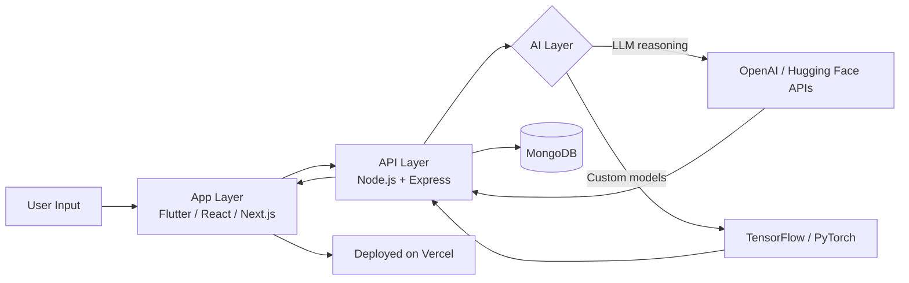

<div align="center">


<br/>

<a href="https://www.linkedin.com/in/muzamil-khan-6840b2292/"></a>
<a href="mailto:muzamilkhanofficials@gmail.com"></a>
<a href="https://github.com/Zaibten"></a>
<a href="https://wa.me/923363506933"></a>
<a href="https://www.instagram.com/muzamilkhan_508/"></a>

<br/>


</div>


## 🧠 About Me

I'm **Muzamil** — an independent, entrepreneurially-minded developer building software products with **global market potential**. I operate as a builder, not an employee: I scope, design, ship, and iterate on products end-to-end — mobile, web, backend, and the AI layer that increasingly sits underneath all of it.

```python
class Muzamil:
    def __init__(self):
        self.location = "Pakistan"
        self.role = "Independent Builder · Full-Stack & AI Engineer"
        self.works_as = "Solo founder / small-team builder — not traditional employment"
        self.focus = [
            "AI-powered products",
            "SaaS platforms",
            "Mobile-first apps",
            "Workflow automation",
        ]
        self.stack = {
            "frontend": ["Flutter", "React Native", "React", "Next.js"],
            "backend": ["Node.js", "Express", "MongoDB"],
            "deploy": "Vercel",
        }

    def philosophy(self):
        return "Ship inside existing infrastructure. Minimal moving parts, maximum leverage."

    def current_mission(self):
        return "Building AI-native software that competes globally, from a lean base."
```


## 🤖 How AI Fits Into My Work

I don't just use AI as a buzzword — it's a working layer in the products I build. Typical shape of an AI-integrated product I ship:



**Where I apply it in practice:**

| Area | Applied Use |
|---|---|
| 🧩 Product intelligence | LLM-powered features (generation, summarization, classification) via OpenAI / Hugging Face |
| 👁️ Computer vision | Detection & classification models (e.g. real-time helmet detection) with TensorFlow/OpenCV |
| 📈 Forecasting | Demand & inventory prediction models for operational tooling |
| 🗣️ NLP | Review/sentiment analysis pipelines for customer-facing data |
| ⚙️ Automation | AI-assisted onboarding, scraping, and internal tooling agents |


## ⚙️ Tech Arsenal

<div align="center">

**Frontend & Mobile**
<br/>


**Backend & Data**
<br/>


**AI / ML**
<br/>


**DevOps, Tools & Design**
<br/>


</div>


## 🛠️ What I Build

<table>
<tr>
<td width="33%" valign="top">

### 📱 Mobile & Cross-Platform
End-to-end apps in Flutter and React Native — from UI to backend to store deployment.

- AI-powered image generation apps
- Ride-sharing / carpooling platforms
- 3D/AR visualization apps

</td>
<td width="33%" valign="top">

### 🌐 Web Platforms & SaaS
Full-stack products on React/Next.js + Node.js, built to scale beyond a single market.

- AI tools directories & discovery platforms
- Labour/contractor marketplace platforms
- eCommerce + ERP/CRM systems

</td>
<td width="33%" valign="top">

### 🤖 AI-Powered Systems
Applied ML/AI features embedded directly into product workflows, not bolted on.

- Employee onboarding AI agents
- Review/sentiment analysis engines
- Forecasting & detection models

</td>
</tr>
</table>


## 🏆 Flagship Builds

- **PictureAI** — AI image-generation mobile app (Flutter + Node.js + OpenAI)
- **AI Inventory Management** — Django-based demand forecasting engine
- **Helmet Detection** — Real-time deep-learning safety detection system
- **Criminal Detection Web App** — Predictive analytics on historical crime data
- **Zaibten Scrapper** — NLP-driven customer review intelligence tool
- **Car Auction Platform** — Real-time price prediction + verification tooling
- **Car-Pooling App** — Cross-platform ride-sharing (Flutter + React)
- **Anatomy 3D Mobile App** — React Native + Node.js medical visualization
- **eCommerce + ERP/CRM Suite** — .NET MVC business operations platform
- **Hospital Management System** — Secure resource & patient data platform


## 📊 GitHub Pulse

<div align="center">


<br/><br/>


</div>


## 🐍 Contribution Snake

<div align="center">

<!--START_SECTION:snake-->

<!--END_SECTION:snake-->

<sub>Animated automatically via GitHub Actions — see <code>snake.yml</code> below to enable it on your profile repo.</sub>

</div>


## 🌱 How I Work

| Principle | What it means in practice |
|---|---|
| 🎯 **Outcome-first** | Every build is scoped around the business problem, not the tech |
| ⚡ **Lean by default** | Minimal moving parts, maximum leverage — ship inside existing infra |
| 🧩 **Full-stack ownership** | Comfortable across mobile, web, backend, and AI in the same project |
| 🌍 **Global-market focus** | Products designed to scale beyond a single region from day one |
| 🔁 **Iteration over perfection** | Ship a working version, then refine based on real usage |


<div align="center">

### 🚀 Let's Build Something Intelligent Together

<a href="mailto:muzamilkhanofficials@gmail.com"></a>
<a href="https://wa.me/923363506933"></a>

<br/><br/>


</div>
