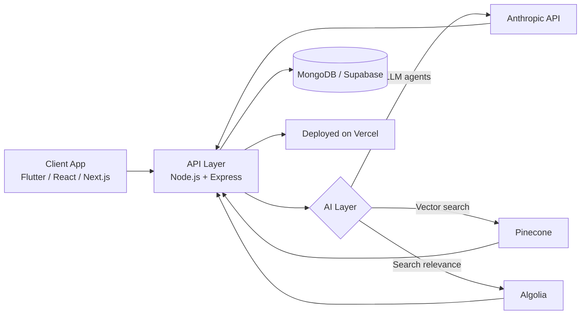

<div align="center">


<h1>Muzamil Khan</h1>
<p><strong>Full-Stack Engineer · AI Systems Builder · Independent Software Developer</strong></p>


<br/><br/>

<a href="https://www.linkedin.com/in/muzamil-khan-6840b2292/"></a>
<a href="mailto:muzamilkhanofficials@gmail.com"></a>
<a href="https://github.com/Zaibten"></a>
<a href="https://wa.me/923363506933"></a>


</div>

## Overview

I'm an independent, entrepreneurially-minded developer based in **Pakistan**, building software products aimed at global markets. I work as a solo builder rather than within a traditional employment structure — scoping, designing, and shipping products end-to-end across mobile, web, backend, and applied AI.

```python
class Muzamil:
    def __init__(self):
        self.location = "Pakistan"
        self.role = "Independent Developer — Full-Stack & Applied AI"
        self.frontend = ["Flutter", "React Native", "React", "Next.js"]
        self.backend = ["Node.js", "Express", "MongoDB"]
        self.deploy = "Vercel"

    def approach(self):
        return "Ship inside existing infrastructure — minimal new surface area, maximum leverage."
```

<br/>

## Where AI Fits In

AI isn't a separate track from my product work — it's a layer inside the systems I build. Current examples: a Next.js/Supabase/Pinecone employee-onboarding agent using the Anthropic API, and an AI tools discovery platform with Algolia-backed fuzzy search.



<br/>

## Core Expertise

| Domain | Technologies |
|---|---|
| **Frontend (Mobile)** | Flutter, React Native |
| **Frontend (Web)** | React, Next.js |
| **Backend** | Node.js, Express, MongoDB |
| **Applied AI** | Anthropic API, Pinecone (vector search), Algolia (search relevance), Supabase |
| **Deployment** | Vercel |

<br/>

## Current Work

<table>
<tr><th align="left" width="26%">Project</th><th align="left">Details</th></tr>

<tr>
<td><strong>Select AI Tools</strong><br/><sub>selectaitool.com</sub></td>
<td>AI tools directory platform (React/Vite · Node.js/Express · MongoDB). Recent work: improved Algolia fuzzy/prefix search relevance, fixed rating-display race conditions, resolved a multi-profession data pipeline issue via Excel upload, and added admin bulk-delete and featured-toggle controls.</td>
</tr>

<tr>
<td><strong>Zaibten Hire</strong></td>
<td>AI employee-onboarding agent, being scaffolded on Next.js, Supabase, Pinecone, and the Anthropic API — grew out of researching high-revenue AI agent concepts for an AI SaaS strategy.</td>
</tr>

<tr>
<td><strong>Labour Hub</strong></td>
<td>Platform connecting labourers and contractors in Pakistan. Built several Node.js/Express admin panel iterations — JWT authentication, bilingual (Urdu/English) UI, real-time Chart.js dashboards with polling, and searchable paginated tables. An earlier React Native client resolved chatbot modal scroll conflicts, double-submission bugs, and Vercel deployment/CORS issues.</td>
</tr>

<tr>
<td><strong>Code Sync</strong></td>
<td>Flutter app for AI-powered code error detection. Completed a full frontend redesign — animated screens, a custom bottom navigation bar, and a consistent dark navy/gradient design system — without touching backend logic.</td>
</tr>

</table>

<br/>

## Other Notable Work

<details>
<summary>FaceTrace — forensic AI sketch generation (Flutter)</summary><br/>

On-device ML pipeline scaffolding built around an existing API integration, plus a full academic project report with programmatically generated UML and DFD diagrams.
</details>

<details>
<summary>Trilingual ML chatbot (Jupyter Notebook)</summary><br/>

Compared 15 classification algorithms on a large synthetic dataset, using a character n-gram TF-IDF approach to handle mixed English, Roman Urdu, and Urdu-script input.
</details>

<details>
<summary>Earlier public repositories</summary><br/>

Helmet detection (computer vision safety system), customer review NLP scraper, car auction price prediction, cross-platform carpooling app, and a hospital management system — spanning Django, .NET, and React Native.
</details>

<br/>

## How I Work

| Principle | In Practice |
|---|---|
| Outcome-first | Every build is scoped to the business problem, not the tech stack |
| Lean by default | Minimal new infrastructure — extend what already exists |
| Full ownership | Comfortable across mobile, web, backend, and the AI layer on the same project |
| Global-market focus | Products built to scale past a single region from day one |

<br/>

## GitHub Activity

<div align="center">


</div>

<p align="center"><sub>These populate from a live GitHub Stats API using the username above. If they don't render, it usually means <code>Zaibten</code> is an organization rather than a personal account — swap in your personal GitHub username and they'll resolve immediately.</sub></p>

<details>
<summary><strong>Optional: animated contribution snake</strong></summary><br/>

A day-by-day animated snake through your contribution graph, generated by a scheduled GitHub Action rather than a static image — so it needs a one-time setup:

1. Add the workflow file below to `.github/workflows/snake.yml` in your `<username>/<username>` profile repo
2. Run it once from the Actions tab (or wait for the daily schedule)
3. Add this to your README once it's live:

```md

```

</details>


<div align="center">
<sub>Open to new projects — reach out via <a href="mailto:muzamilkhanofficials@gmail.com">email</a> or <a href="https://wa.me/923363506933">WhatsApp</a>.</sub>
</div>
